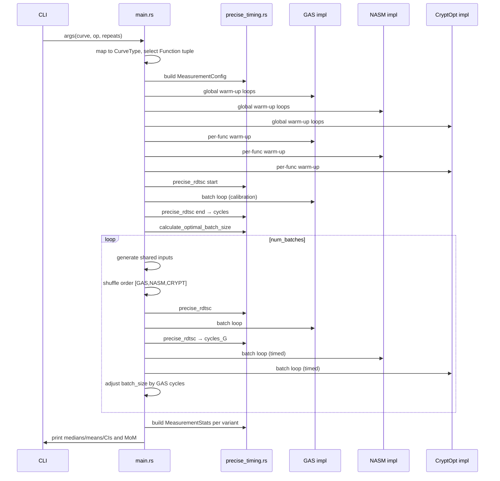

## Measurement Flow and Module Integration

This document explains how the executable wires together the measurement primitives in `src/precise_timing.rs` with the orchestration in `src/main.rs`, and how a run proceeds from CLI to results.

### High-level flow

```mermaid
flowchart TD
    A[CLI: cargo run <curve> <op> [repeats]\nENV: ENHANCED_MEASUREMENT?] --> B{Parse args}
    B -->|CurveType| C[Select curve params\n(get_params)]
    B -->|Operation| D[Op: mul/square]
    C --> E[Select function tuple\nget_mul_functions / get_square_functions]
    E --> F{Enhanced mode?}
    F -->|Yes| G[run_enhanced_measurements]
    F -->|No| H[run_repeated_measurements_*]

    subgraph Enhanced Path
    G --> I[Build MeasurementConfig]
    I --> J{Function tuple kind}
    J -->|3 funcs| K[Interleaved enhanced (u64/usize)]
    J -->|5 funcs| L[Interleaved enhanced (five variants)]
    K --> M[Warm-up all → per-func warm-up]
    L --> M
    M --> N[Calibrate batch_size to cycle_goal]
    N --> O[For each of num_batches]
    O --> P[Generate shared inputs per batch]
    P --> Q[Randomize order (Fisher–Yates)]
    Q --> R[Measure each variant using precise_rdtsc]
    R --> S[Adjust batch_size by GAS cycles]
    S --> T[Convert to per-call cycles]
    T --> U[MeasurementStats (median/mean/std/CV/CI)]
    U --> V[Console report + MoM summary]
    end

    subgraph Legacy Path
    H --> W[Fixed batch_size + nBatches]
    W --> X[Regenerate inputs per batch]
    X --> Y[Measure variants, collect batch cycles]
    Y --> Z[Median of batch cycles]
    end
```

### Key components and interactions

- `MeasurementConfig` (precise_timing): Parameters for enhanced runs (cycle goal, batches, warm-ups, min/max batch size).
- `precise_rdtsc` (precise_timing): RDTSC with `_mm_mfence` before reads to reduce reordering noise.
- `measure_one_batch_*` (main.rs): Tight loop calling a selected FFI function `batch_size` times, timed with `precise_rdtsc`.
- `calculate_optimal_batch_size` (precise_timing): Scales batch size to approach `cycle_goal` based on observed cycles.
- Interleaved enhanced runners (main.rs):
  - Warm up globally, then per function.
  - Calibrate shared `batch_size` against GAS baseline.
  - Collect batches in randomized order with shared inputs per batch.
  - Convert raw batch cycles to per-call cycles and aggregate into `MeasurementStats`.
- `MeasurementStats` (precise_timing): Outlier removal (IQR), statistics, CV, 95% CI; used for quality assessment and comparisons.

### Comparison flow (three-function example)



### Notes

- Set `ENHANCED_MEASUREMENT=1` to enable the enhanced interleaved methodology.
- Set `CHECK_OUTPUTS=1` to compare outputs between variants for each batch.
- The OpenSSL 5-way flows follow the same pattern with two additional variants (hand, hand+NASM).


